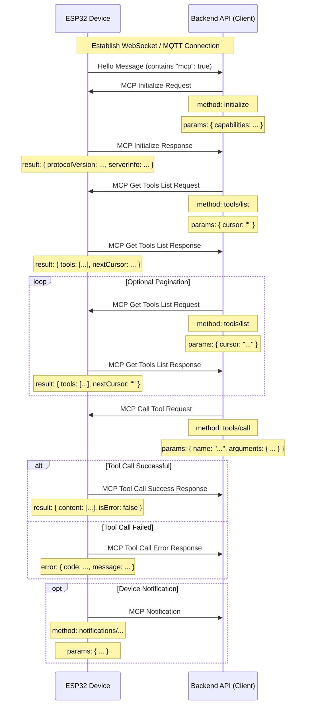

# MCP (Model Context Protocol) Interaction Flow

NOTICE: AI-assisted generation, when implementing backend services, please refer to the code for details!!

The MCP protocol in this project is used for communication between the backend API (MCP client) and ESP32 devices (MCP server), enabling the backend to discover and call functions (tools) provided by the devices.

## Protocol Format

According to the code (`main/protocols/protocol.cc`, `main/mcp_server.cc`), MCP messages are encapsulated within the message body of basic communication protocols (such as WebSocket or MQTT). Their internal structure follows the [JSON-RPC 2.0](https://www.jsonrpc.org/specification) specification.

Overall message structure example:

```json
{
  "session_id": "...", // conversation ID
  "type": "mcp",       // message type，set to "mcp"
  "payload": {         // JSON-RPC 2.0 payload
    "jsonrpc": "2.0",
    "method": "...",   // method name (e.g., "initialize", "tools/list", "tools/call")
    "params": { ... }, // method parameters (for request)
    "id": ...,         // requiest for ID (for request and response)
    "result": { ... }, // method run result (for success response)
    "error": { ... }   // wrong message (for error response)
  }
}
```

Among them, the `payload` part is a standard JSON-RPC 2.0 message:

- `jsonrpc`: Fixed string "2.0".
- `method`: Name of the method to be called (for Request).
- `params`: Method parameters, a structured value, usually an object (for Request).
- `id`: Request identifier, provided by the client when sending the request, returned as-is in the server's response. Used to match requests and responses.
- `result`: Result when the method executes successfully (for Success Response).
- `error`: Error information when the method execution fails (for Error Response).

## 交互流程及发送时机
## Interaction Flow and Timing

MCP 的交互主要围绕客户端（后台 API）发现和调用设备上的"工具"（Tool）进行。
MCP interactions primarily revolve around the client (backend API) discovering and calling "tools" on the device.

1.  **连接建立与能力通告**
1.  **Connection Establishment and Capability Announcement**

    - **Timing:** After the device starts up and successfully connects to the backend API.

    - **Sender:** Device.

    - **Message:** The device sends a "hello" message of the basic protocol to the backend API, containing a list of capabilities supported by the device, for example, indicating MCP protocol support (`"mcp": true`) through the `CONFIG_IOT_PROTOCOL_MCP` configuration.

    - **Example (not MCP payload, but basic protocol message):**
      ```json
      {
        "type": "hello",
        "version": ...,
        "features": {
          "mcp": true,
          ...
        },
        "transport": "websocket", // or "mqtt"
        "audio_params": { ... },
        "session_id": "..." // may be set after device receives server hello
      }
      ```

2.  **Initialize MCP Session**

    - **Timing:** After the backend API receives the device's "hello" message and confirms MCP support, typically sent as the first request of the MCP session.

    - **Sender:** Backend API (client).

    - **Method:** `initialize`

    - **消息 (MCP payload):**
    
    - **Message (MCP payload):**
      ```json
      {
        "jsonrpc": "2.0",
        "method": "initialize",
        "params": {
          "capabilities": {
            // Client capabilities, optional

            // Camera vision related
            "vision": {
              "url": "...", // Camera: image processing address (must be http address, not websocket address)
              "token": "..." // url token
            }

            // ... other client capabilities
          }
        },
        "id": 1 // Request ID
      }
      ```

    - **Device Response Timing:** After the device receives and processes the `initialize` request.

    - **Device Response Message (MCP payload):**
      ```json
      {
        "jsonrpc": "2.0",
        "id": 1, // Match request ID
        "result": {
          "protocolVersion": "2024-11-05",
          "capabilities": {
            "tools": {} // Tools here don't list detailed information, requires tools/list
          },
          "serverInfo": {
            "name": "...", // Device name (BOARD_NAME)
            "version": "..." // Device firmware version
          }
        }
      }
      ```

3.  **Discover Device Tools List**

    - **Timing:** When the backend API needs to obtain the list of specific functions (tools) currently supported by the device and their invocation methods.

    - **Sender:** Backend API (client).

    - **Method:** `tools/list`

    - **Message (MCP payload):**
      ```json
      {
        "jsonrpc": "2.0",
        "method": "tools/list",
        "params": {
          "cursor": "" // For pagination, empty string for first request
        },
        "id": 2 // Request ID
      }
      ```

    - **Device Response Timing:** After the device receives the `tools/list` request and generates the tools list.

    - **Device Response Message (MCP payload):**
      ```json
      {
        "jsonrpc": "2.0",
        "id": 2, // Match request ID
        "result": {
          "tools": [ // List of tool objects
            {
              "name": "self.get_device_status",
              "description": "...",
              "inputSchema": { ... } // Parameter schema
            },
            {
              "name": "self.audio_speaker.set_volume",
              "description": "...",
              "inputSchema": { ... } // Parameter schema
            }
            // ... more tools
          ],
          "nextCursor": "..." // If the list is large and requires pagination, this will contain the cursor value for the next request
        }
      }
      ```

    - **分页处理：** 如果 `nextCursor` 字段非空，客户端需要再次发送 `tools/list` 请求，并在 `params` 中带上这个 `cursor` 值以获取下一页工具。
    - **Pagination Handling:** If the `nextCursor` field is not empty, the client needs to send another `tools/list` request with this `cursor` value in the `params` to obtain the next page of tools.

4.  **调用设备工具**
4.  **Call Device Tool**

    - **Timing:** When the backend API needs to execute a specific function on the device.

    - **Sender:** Backend API (client).

    - **Method:** `tools/call`

    - **Message (MCP payload):**
      ```json
      {
        "jsonrpc": "2.0",
        "method": "tools/call",
        "params": {
          "name": "self.audio_speaker.set_volume", // Name of the tool to call
          "arguments": {
            // Tool parameters, object format
            "volume": 50 // Parameter name and its value
          }
        },
        "id": 3 // Request ID
      }
      ```

    - **Device Response Timing:** After the device receives the `tools/call` request and executes the corresponding tool function.

    - **Device Success Response Message (MCP payload):**
      ```json
      {
        "jsonrpc": "2.0",
        "id": 3, // Match request ID
        "result": {
          "content": [
            // Tool execution result content
            { "type": "text", "text": "true" } // Example: set_volume returns bool
          ],
          "isError": false // Indicates success
        }
      }
      ```

    - **Device Error Response Message (MCP payload):**
      ```json
      {
        "jsonrpc": "2.0",
        "id": 3, // Match request ID
        "error": {
          "code": -32601, // JSON-RPC error code, e.g., Method not found (-32601)
          "message": "Unknown tool: self.non_existent_tool" // Error description
        }
      }
      ```

5.  **Device-initiated Messages (Notifications)**

    - **Timing:** When events occur within the device that need to be notified to the backend API (e.g., state changes, although there are no explicit tools in the code examples sending such messages, the existence of `Application::SendMcpMessage` suggests that the device may actively send MCP messages).

    - **Sender:** Device (server).

    - **Method:** May be a method name starting with `notifications/`, or other custom methods.

    - **Message (MCP payload):** Follows JSON-RPC Notification format, without the `id` field.
      ```json
      {
        "jsonrpc": "2.0",
        "method": "notifications/state_changed", // Example method name
        "params": {
          "newState": "idle",
          "oldState": "connecting"
        }
        // No id field
      }
      ```
    - **Backend API Processing:** After receiving the Notification, the backend API processes it accordingly but does not respond.

## Interaction Diagram

Below is a simplified interaction sequence diagram showing the main MCP message flow:



This document outlines the main interaction flow of the MCP protocol in this project. For specific parameter details and tool functionality, please refer to `McpServer::AddCommonTools` in `main/mcp_server.cc` and the implementation of individual tools.
