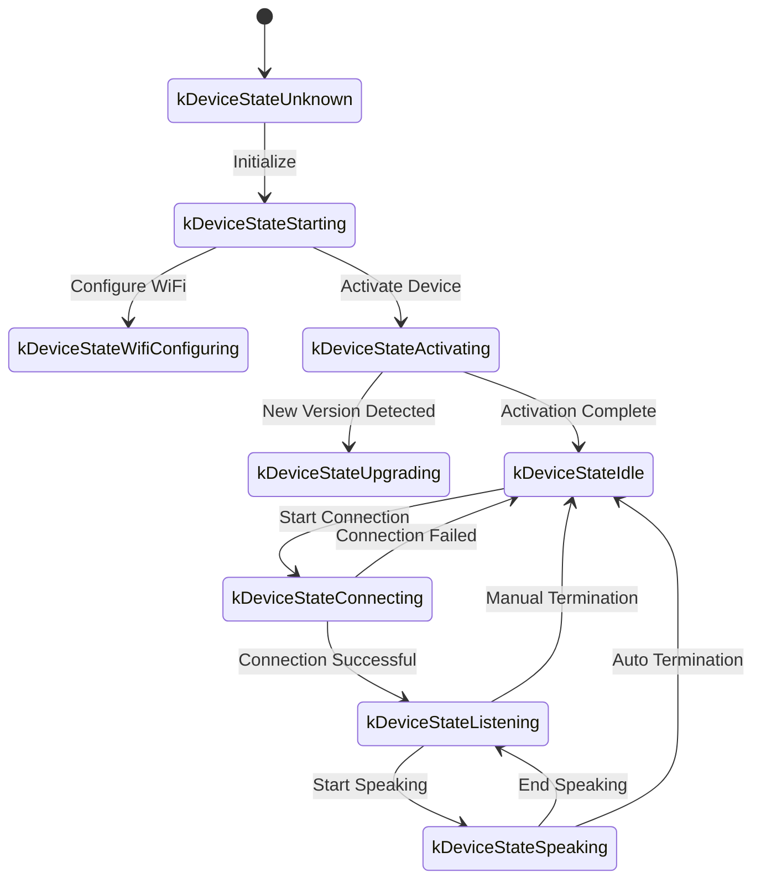
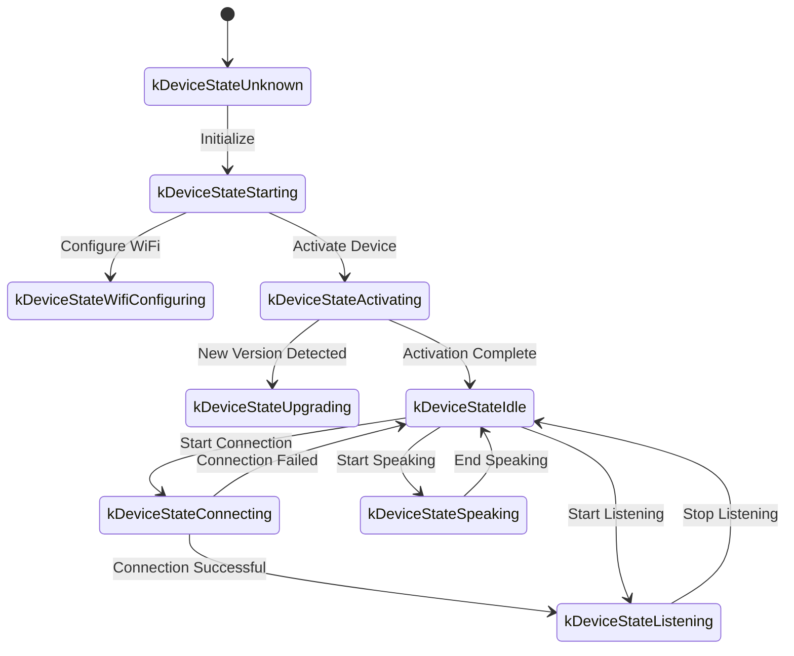

This is a WebSocket communication protocol documentation based on code implementation, outlining how the device and server interact through WebSocket.

This document is inferred from the provided code and may require further confirmation or supplementation based on server-side implementation during actual deployment.

---

## 1. Overall Process Overview

1. **Device Initialization**  
   - Device power-on, `Application` initialization:  
     - Initialize audio codec, display, LED, etc.  
     - Connect to network  
     - Create and initialize WebSocket protocol instance (`WebsocketProtocol`) implementing the `Protocol` interface  
   - Enter main loop waiting for events (audio input, audio output, scheduled tasks, etc.).

2. **Establish WebSocket Connection**  
   - When the device needs to start a voice session (e.g., user wake-up, manual button trigger), call `OpenAudioChannel()`:  
     - Get WebSocket URL from configuration
     - Set request headers (`Authorization`, `Protocol-Version`, `Device-Id`, `Client-Id`)  
     - Call `Connect()` to establish WebSocket connection with server  

3. **Device Sends "hello" Message**  
   - After successful connection, device sends a JSON message with structure like:  
   ```json
   {
     "type": "hello",
     "version": 1,
     "features": {
       "mcp": true
     },
     "transport": "websocket",
     "audio_params": {
       "format": "opus",
       "sample_rate": 16000,
       "channels": 1,
       "frame_duration": 60
     }
   }
   ```
   - The `features` field is optional, content automatically generated based on device compilation configuration. For example: `"mcp": true` indicates MCP protocol support.
   - `frame_duration` value corresponds to `OPUS_FRAME_DURATION_MS` (e.g., 60ms).

4. **Server Replies with "hello"**  
   - Device waits for server to return a JSON message containing `"type": "hello"` and checks if `"transport": "websocket"` matches.  
   - Server may optionally send a `session_id` field, which device will automatically record.  
   - Example:
   ```json
   {
     "type": "hello",
     "transport": "websocket",
     "session_id": "xxx",
     "audio_params": {
       "format": "opus",
       "sample_rate": 24000,
       "channels": 1,
       "frame_duration": 60
     }
   }
   ```
   - If matched, server is considered ready, and audio channel is marked as successfully opened.  
   - If correct reply not received within timeout (default 10 seconds), connection is considered failed and network error callback is triggered.

5. **Subsequent Message Exchange**  
   - Two main types of data can be sent between device and server:  
     1. **Binary Audio Data** (Opus encoded)  
     2. **Text JSON Messages** (for chat state, TTS/STT events, MCP protocol messages, etc.)  

   - In the code, receive callbacks are mainly divided into:  
     - `OnData(...)`:  
       - When `binary` is `true`, considered as audio frame; device will decode it as Opus data.  
       - When `binary` is `false`, considered as JSON text, needs to be parsed with cJSON on device side and processed for corresponding business logic (chat, TTS, MCP protocol messages, etc.).  

   - When server or network disconnects, `OnDisconnected()` callback is triggered:  
     - Device will call `on_audio_channel_closed_()` and eventually return to idle state.

6. **Close WebSocket Connection**  
   - When device needs to end voice session, it calls `CloseAudioChannel()` to actively disconnect and return to idle state.  
   - Or if server actively disconnects, same callback flow is triggered.

---

## 2. Common Request Headers

When establishing WebSocket connection, the following request headers are set in the code example:

- `Authorization`: Used to store access token, format like `"Bearer <token>"`  
- `Protocol-Version`: Fixed as `"1"` in example, consistent with `version` field in hello message body  
- `Device-Id`: Device physical network card MAC address
- `Client-Id`: Software-generated UUID (resets when NVS is erased or firmware is reflashed)

These headers are sent with WebSocket handshake to server, which can perform validation and authentication as needed.

---

## 3. JSON Message Structure

WebSocket text frames are transmitted in JSON format. Below are common `"type"` fields and their corresponding business logic. If message contains fields not listed, they may be optional or specific implementation details.

### 3.1 Device → Server

1. **Hello**  
   - Sent by device after successful connection, informing server of basic parameters.  
   - Example:
     ```json
     {
       "type": "hello",
       "version": 1,
       "features": {
         "mcp": true
       },
       "transport": "websocket",
       "audio_params": {
         "format": "opus",
         "sample_rate": 16000,
         "channels": 1,
         "frame_duration": 60
       }
     }
     ```

2. **Listen**  
   - Indicates device starting or stopping audio recording.  
   - Common fields:  
     - `"session_id"`: Session identifier  
     - `"type": "listen"`  
     - `"state"`: `"start"`, `"stop"`, `"detect"` (wake word detected)  
     - `"mode"`: `"auto"`, `"manual"` or `"realtime"`, indicating recognition mode.  
   - Example: Start listening  
     ```json
     {
       "session_id": "xxx",
       "type": "listen",
       "state": "start",
       "mode": "manual"
     }
     ```

3. **Abort**  
- Terminate current speech (TTS playback) or audio channel.  
   - Example:
     ```json
     {
       "session_id": "xxx",
       "type": "abort",
       "reason": "wake_word_detected"
     }
     ```
   - `reason` value can be `"wake_word_detected"` or others.

4. **Wake Word Detected**  
   - Used by device to inform server of wake word detection.
   - Before sending this message, wake word Opus audio data can be sent in advance for server voiceprint detection.  
   - Example:
     ```json
     {
       "session_id": "xxx",
       "type": "listen",
       "state": "detect",
       "text": "Hello Xiaoming"
     }
     ```

5. **MCP**
   - Recommended new generation protocol for IoT control. All device capability discovery, tool calls, etc. are done through type: "mcp" messages, with payload containing standard JSON-RPC 2.0 (see [MCP Protocol Documentation](./mcp-protocol.md)).
   
   - **Example of device sending result to server:**
     ```json
     {
       "session_id": "xxx",
       "type": "mcp",
       "payload": {
         "jsonrpc": "2.0",
         "id": 1,
         "result": {
           "content": [
             { "type": "text", "text": "true" }
           ],
           "isError": false
         }
       }
     }
     ```

---

### 3.2 Server → Device

1. **Hello**  
   - Server's handshake confirmation message.  
   - Must contain `"type": "hello"` and `"transport": "websocket"`.  
   - May include `audio_params`, indicating server's expected audio parameters or aligned configuration with device.   
   - Server may optionally send `session_id` field, which device will automatically record.  
   - After successful reception, device sets event flag indicating WebSocket channel is ready.

2. **STT**  
   - `{"session_id": "xxx", "type": "stt", "text": "..."}`
   - Indicates server has recognized user's speech. (e.g., speech-to-text result)  
   - Device may display this text on screen, then proceed to response flow.

3. **LLM**  
   - `{"session_id": "xxx", "type": "llm", "emotion": "happy", "text": "😀"}`
   - Server instructs device to adjust expression animation / UI expression.  

4. **TTS**  
   - `{"session_id": "xxx", "type": "tts", "state": "start"}`: Server preparing to send TTS audio, device enters "speaking" playback state.  
   - `{"session_id": "xxx", "type": "tts", "state": "stop"}`: Indicates end of this TTS.  
   - `{"session_id": "xxx", "type": "tts", "state": "sentence_start", "text": "..."}`
     - Lets device display current text segment to be played or read (e.g., for user display).  

5. **MCP**
   - Server sends IoT-related control commands or returns call results through type: "mcp" messages, payload structure same as above.
   
   - **Example of server sending tools/call to device:**
     ```json
     {
       "session_id": "xxx",
       "type": "mcp",
       "payload": {
         "jsonrpc": "2.0",
         "method": "tools/call",
         "params": {
           "name": "self.light.set_rgb",
           "arguments": { "r": 255, "g": 0, "b": 0 }
         },
         "id": 1
       }
     }
     ```

6. **Audio Data: Binary Frames**  
   - When server sends audio binary frames (Opus encoded), device decodes and plays them.  
   - If device is in "listening" (recording) state, received audio frames are ignored or cleared to prevent conflicts.

---

## 4. Audio Codec

1. **Device Sends Recording Data**  
   - Audio input goes through possible echo cancellation, noise reduction or volume gain, then packaged into binary frames via Opus encoding and sent to server.  
   - If device generates binary frame of size N bytes each time, this data is sent through WebSocket **binary** message.

2. **Device Plays Received Audio**  
   - When receiving binary frames from server, they are also considered Opus data.  
   - Device decodes them, then sends to audio output interface for playback.  
   - If server's audio sample rate differs from device, resampling is performed after decoding.

---

## 5. Common State Transitions

Below are common device key state transitions, corresponding to WebSocket messages:

1. **Idle** → **Connecting**  
   - After user trigger or wake-up, device calls `OpenAudioChannel()` → Establishes WebSocket connection → Sends `"type":"hello"`.  

2. **Connecting** → **Listening**  
   - After successful connection, if `SendStartListening(...)` continues execution, enters recording state. Device continuously encodes microphone data and sends to server.  

3. **Listening** → **Speaking**  
   - Receives server TTS Start message (`{"type":"tts","state":"start"}`) → Stops recording and plays received audio.  

4. **Speaking** → **Idle**  
   - Server TTS Stop (`{"type":"tts","state":"stop"}`) → Audio playback ends. If not continuing to auto-listen, returns to Idle; if auto-cycle configured, enters Listening again.  

5. **Listening** / **Speaking** → **Idle** (encountering exception or active interruption)  
   - Call `SendAbortSpeaking(...)` or `CloseAudioChannel()` → Interrupts session → Closes WebSocket → State returns to Idle.  

### Auto Mode State Transition Diagram



### Manual Mode State Transition Diagram



---

## 6. Error Handling

1. **Connection Failure**  
   - If `Connect(url)` returns failure or times out waiting for server "hello" message, triggers `on_network_error_()` callback. Device will prompt "Unable to connect to service" or similar error message.

2. **Server Disconnection**  
   - If WebSocket abnormally disconnects, `OnDisconnected()` callback:  
     - Device calls `on_audio_channel_closed_()`  
     - Switches to Idle or other retry logic.

---

## 7. Other Notes

1. **Authentication**  
   - Device provides authentication through `Authorization: Bearer <token>`, server needs to verify validity.  
   - If token expired or invalid, server can reject handshake or disconnect later.

2. **Session Control**  
   - Some messages in code contain `session_id` for distinguishing independent conversations or operations. Server can process different sessions separately as needed.

3. **Audio Payload**  
   - Code defaults to Opus format with `sample_rate = 16000`, mono channel. Frame duration controlled by `OPUS_FRAME_DURATION_MS`, typically 60ms. Can be adjusted based on bandwidth or performance. For better music playback, server downlink audio may use 24000 sample rate.

4. **IoT Control Recommends MCP Protocol**  
   - Device-server IoT capability discovery, state synchronization, control commands, etc., should all be implemented through MCP protocol (type: "mcp"). Original type: "iot" solution is deprecated.
   - MCP protocol can be transmitted over WebSocket, MQTT and other underlying protocols, with better extensibility and standardization capabilities.
   - For detailed usage, refer to [MCP Protocol Documentation](./mcp-protocol.md) and [MCP IoT Control Usage](./mcp-usage.md).

5. **Error or Exception JSON**  
   - When JSON lacks required fields, e.g., `{"type": ...}`, device logs error (`ESP_LOGE(TAG, "Missing message type, data: %s", data);`), does not execute any business logic.

---

## 8. Message Examples

Below is a typical bidirectional message example (simplified flow):

1. **Device → Server** (Handshake)
   ```json
   {
     "type": "hello",
     "version": 1,
     "features": {
       "mcp": true
     },
     "transport": "websocket",
     "audio_params": {
       "format": "opus",
       "sample_rate": 16000,
       "channels": 1,
       "frame_duration": 60
     }
   }
   ```

2. **Server → Device** (Handshake Response)
   ```json
   {
     "type": "hello",
     "transport": "websocket",
     "session_id": "xxx",
     "audio_params": {
       "format": "opus",
       "sample_rate": 16000
     }
   }
   ```

3. **Device → Server** (Start Listening)
   ```json
   {
     "session_id": "xxx",
     "type": "listen",
     "state": "start",
     "mode": "auto"
   }
   ```
   Device simultaneously starts sending binary frames (Opus data).

4. **Server → Device** (ASR Result)
   ```json
   {
     "session_id": "xxx",
     "type": "stt",
     "text": "User's speech"
   }
   ```

5. **Server → Device** (TTS Start)
   ```json
   {
     "session_id": "xxx",
     "type": "tts",
     "state": "start"
   }
   ```
   Server then sends binary audio frames for device playback.

6. **Server → Device** (TTS End)
   ```json
   {
     "session_id": "xxx",
     "type": "tts",
     "state": "stop"
   }
   ```
   Device stops playing audio, if no more instructions, returns to idle state.

---

## 9. Summary

This protocol completes functions including audio stream upload, TTS audio playback, speech recognition and state management, MCP command delivery, etc., through transmitting JSON text and binary audio frames over WebSocket. Its core features:

- **Handshake Phase**: Send `"type":"hello"`, wait for server response.  
- **Audio Channel**: Bidirectional transmission of voice streams using Opus-encoded binary frames.  
- **JSON Messages**: Use `"type"` as core field to identify different business logic, including TTS, STT, MCP, WakeWord, etc.  
- **Extensibility**: Can add fields to JSON messages or perform additional authentication in headers based on actual needs.

Server and device need to agree in advance on meaning of various message fields, sequence logic, and error handling rules to ensure smooth communication. Above information can serve as basic documentation for subsequent integration, development, or extension.
